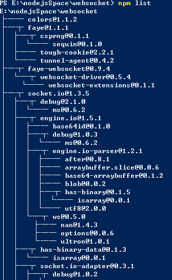

# node

实现斗地主GUI，关键是理解业务需求并用算法实现
[斗地主](http://www.cnblogs.com/limingxi/p/4118642.html)

less-nodejs
sass-ruby/compass
RapidJSON-tencent
FastJSON-alibaba
使用h5资源的离线化做到本地缓存
nodejs+reddis
用java/php写一个自己所有项目的代码行数的统计程序；

jsp+ajax+cookies:单点登录/注销，多域名共用
nodejs+cookies：SPA+会话保存登录状态+cookies3分钟记录登录状态；
nodejs+h5(websocket):即时通行应用+消息推送+网络五子棋（围棋）；

使用递归:└,│,├,─,┬,使用这些符号模拟npm list画出某个文件夹的树形结构;

