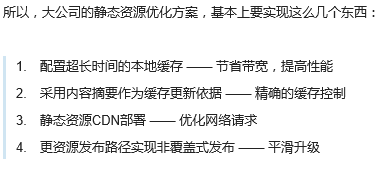

python:web.py,flask(jinja2),Django,Pylons,Bottle,Tornado
ruby:Sinatra, Padrino
php:(smarty)
node:express(jade,ejs)
java:(Freemarker,velocity)

Baidu Fis3
http://fis.baidu.com/

h5 实现 iOS 和 Android 两种移动 app 方式并在手机上真机测试；

gif的压缩和播放,加上"gif"标记;

http://python.jobbole.com/81065/
写一个自己的书并且自己的卖书网站，结合银联api/微信api/支付api/财付通api来支付

http://www.zhihu.com/question/20790576
前端工程化研究，技术选型和已有的优秀方案；看看百度的fis
(https://github.com/fouber/blog)，在github上搭建自己博客，用markdown写博客，app上浏览效果使用，利用已有的api封装自己的github app（iOS,Android，hybrid）/h5站；
著作权归作者所有。
商业转载请联系作者获得授权，非商业转载请注明出处。
作者：张云龙
链接：http://www.zhihu.com/question/20790576/answer/32602154
来源：知乎

facebook是这个领域的鼻祖，有兴趣、有梯子的同学可以去看看facebook的页面源代码，体会一下什么叫工程化。

学习知乎的这种，复制粘贴文字时附带来源的做法。大赞

rails assets pipeline，看看 node 中有没有对应的解决方案；

